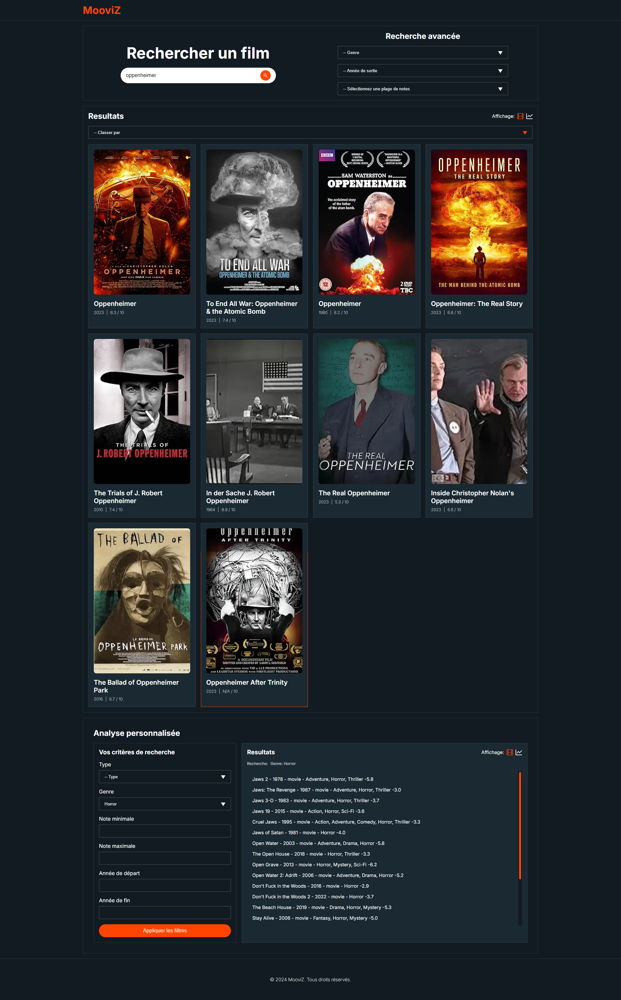
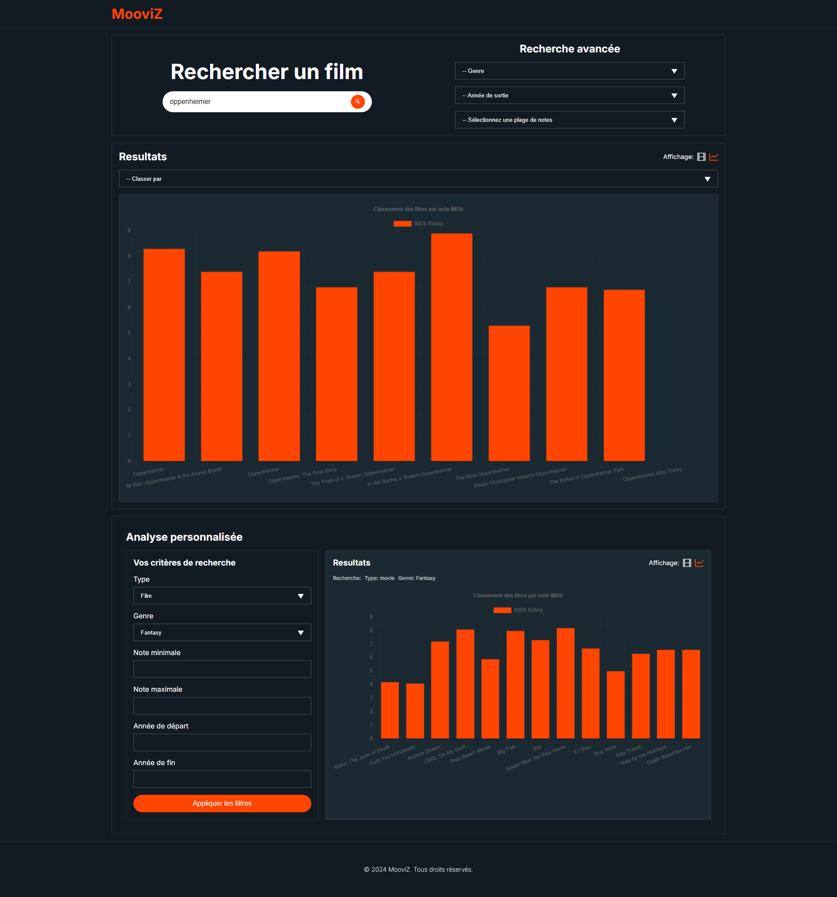

# MooviZ

#### Application de Recherche et Gestion de Films avec Analyse Visuelle

# • • •

## Description
Cette application web permet aux utilisateurs de rechercher des films via l'API publique OMDb, de filtrer les résultats, et de visualiser des classements dynamiques selon différents critères. Les utilisateurs peuvent définir leurs propres critères de classement (année de sortie, popularité, etc.) et afficher les résultats sous forme de graphiques interactifs.

## Fonctionnalités
- **Recherche de film** : Permet de rechercher des films par mot-clé contenu dans le titre.
- **Recherche avancée** : Filtrage par genre, année de sortie, et plage de note IMDb.
- **Classements dynamiques** : Classe les films selon plusieurs critères et affiche les résultats sous forme de graphiques interactifs.
- **Analyse personnalisée** : Les utilisateurs peuvent définir leurs propres critères de classement et voir une visualisation des résultats sous forme de liste ou de graphiques.
- **Interface** : Entièrement responsive avec une expérience utilisateur et une interface conviviales. Interface sur une seule page avec basculement entre plusieurs vues.

## Technologies utilisées
- **Next.js / React** : Pour la création de l’interface utilisateur.
- **TypeScript** : Pour le typage des données.
- **Zustand** : Pour la gestion des états clients.
- **Sass** : Pour le design personnalisé.
- **Chart.js** : Bibliothèque pour les graphiques interactifs.
- **Iconify** : Bibliothèque d’icônes.
- **Jest / Testing Library** : Pour les tests unitaires.

## Configuration

### Utilisation de l’API OMDb
L’application utilise l’API OMDb pour récupérer les informations sur les films. Pour utiliser cette API, vous devez obtenir une clé API personnelle.

1. Rendez-vous sur le site [OMDb API](https://www.omdbapi.com/) pour récupérer une clé API.
2. Créez un fichier `.env` à la racine du projet et ajoutez-y la clé comme suit :
   ```plaintext
   NEXT_PUBLIC_OMDB_APIKEY=VotreCléApi
3. Assurez-vous que votre fichier `.env` est ignoré par Git. Le fichier .gitignore  doit inclure .env pour éviter que la clé ne soit exposée publiquement.


## Installation

1. Clonez le dépôt:
   ```plaintext
   git clone https://github.com/votre-id-utilisateur/MooviZ.git
2. Accédez au projet: 
   ```plaintext
   cd MooviZ
3. Installez les dépendances: 
   ```plaintext
   npm install
4. Configurez votre clé API OMDb dans un fichier `.env` comme décrit dans la section Configuration.
5. Lancez le serveur de développement:
   ```plaintext
   npm run dev
6. Ouvrez votre navigateur et accédez à http://localhost:3000 pour voir l'application en action.
   
## Fonctionnement de l’application

- **Recherche de films** : Entrez un mot-clé dans la barre de recherche pour trouver des films correspondants. L’API retournera jusqu’à 10 résultats. Ces résultats seront affichés sous forme d’affiches ou de graphiques.

- **Recherche avancée** : Utilisez les filtres (par genre, année de sortie, plage de note) pour affiner les résultats. Les filtres « genre » et « année de sortie » sont renseignés dynamiquement selon les résultats retournés.

- **Classement dynamique** : Dans la section « Résultats », classez dynamiquement les films selon un critère de popularité ou d’année de sortie. Le classement s’effectue de manière réactive dans les deux vues (Affiches et Graphique).

- **Analyse personnalisée** : La section « Analyse personnalisée » apparaît dès la première recherche de films, qui commencent à constituer une banque de films stockée dans le local storage. Définissez vos propres critères parmi le type, le genre, la note (minimale ou maximale), l’année de sortie (début et fin), et visualisez les résultats dans une fenêtre dédiée où vous pouvez basculer entre une vue sous forme de liste ou une vue sous forme de graphique interactif.

## Tests

Des tests unitaires ont été écrits pour assurer le bon fonctionnement des fonctionnalités critiques de l’application. Pour les exécuter, utilisez la commande suivante: 
`npm run test`

## À propos de l’API OMDb

L'API OMDb est une base de données de films en ligne qui fournit des informations détaillées sur les films (titre, année de sortie, acteurs, synopsis, etc.). L'application utilise cette API pour récupérer les données de films en temps réel. Chaque requête à l'API nécessite une clé API, qui est stockée dans un fichier .env pour des raisons de sécurité.

**À noter** : Dans sa forme actuelle, **l’application ne sollicite l’API OMDb que lors de la recherche de films**. Toutes les autres manipulations sont gérées via le local storage combiné au state manager **Zustand**, ce qui évite la surcharge de l’API et améliore les performances générales de l’application.

**Exemple de reponse:**

Il existe plusieurs types de requêtes. Pour cette appli ont été utilisées:

1. Requête **"Search"**. Permet de retourner une liste de films (jusque 10) ne contenant que les informations essentielles:
      ```
      "Search": [
         {
            "Title": "Oppenheimer",
            "Year": "2023",
            "imdbID": "tt15398776",
            "Type": "movie",
            "Poster": "chemin de l'affiche"
         }, 
         etc...
      ]

2. Requête par **Id**. Permet de retourner un film par son id avec tout le détail dont "Genre", crucial pour les filtrages : 
      ```
         {
            "Title": "Oppenheimer",
            "Year": "2023",
            "Rated": "R",
            "Released": "21 Jul 2023",
            "Runtime": "180 min",
            "Genre": "Biography, Drama, History",
            "Director": "Christopher Nolan",
            "Writer": "Christopher Nolan, Kai Bird, Martin Sherwin",
            "Actors": "Cillian Murphy, Emily Blunt, Matt Damon",
            "Plot": "The story of American scientist J. Robert Oppenheimer and his role in the development of the atomic bomb.",
            "Language": "English, German, Italian",
            "Country": "United States, United Kingdom",
            etc...
         }

Un interaction entre ces 2 formats API a été mis en place pour obtenir toute les données nécessaire au bon fonctionnement de l'application.

## Screenshots

1. Interface:  Résultat de recherche en mode "Affiche" et résultat d'analyse en mode "Liste".



2. Interface:  Résultat de recherche et résultat d'analyse en mode "Graphique".



## Démo 

Une démo entiérement utilisable est déployée sur Vercel. Suivez le lien pour la tester: 
 →  <a href="https://mooviz-eight.vercel.app/">MooviZ</a>

##

**Bonne découverte !**

FX.

